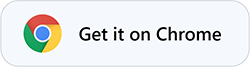
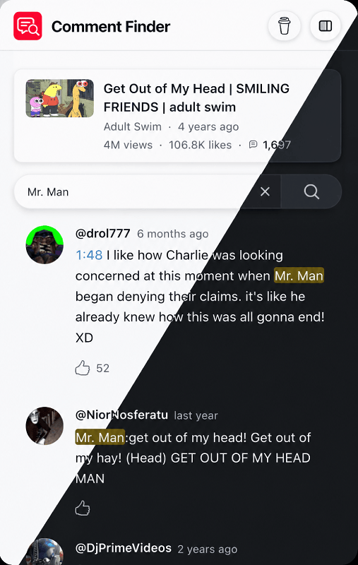
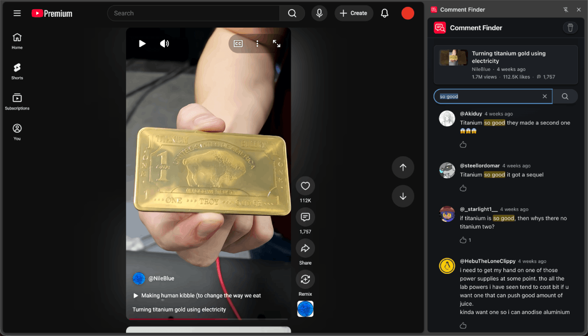

<div class="flex items-center">
  
  &nbsp;
  <h1>Comment Finder</h1>
</div>


<p align="center">`Search comments on YouTube` videos, Shorts and across channels.</p>
</br>

---

<p align="center">
  <a href="https://chromewebstore.google.com/detail/comment-finder-for-youtub/ecidemeccmgcmgaadfdaoajoalnbpgkl">
    
  </a>
</p>

<div style="display:flex;flex-wrap:wrap;align-items:center;gap:16px;">
  &nbsp;&nbsp;&nbsp;
  
</div>

## Features

- Search in comments and replies on currently open YouTube video, Shorts or channel page.
- Can be used from the toolbar popup or the side panel.
- 100 results per search + infinite scroll pagination
- Toolbar icon changes color dynamically and shows whether current page is searchable (red) or not (gray).
- Popup and side-panel automatically update on tab changes and YouTube navigation, and restore previous search state when closed and reopened.
- Clickable comment links and timestamps.
- Uses the official YouTube Data API v3 to search comments, no page scraping or injection.
- Minimal permissions.

## Installing from source

Requires [Bun](https://bun.com/) 1.1+, a [Cloudflare](https://dash.cloudflare.com/sign-up) account with [Workers](https://developers.cloudflare.com/workers/), and a [Google API key](https://console.cloud.google.com/apis/credentials) restricted to [YouTube Data API v3](https://console.cloud.google.com/apis/library/youtube.googleapis.com).

```bash
bun install

# 1. Build the extension against your Worker origin.
#    http://127.0.0.1:8787 is the default address of `wrangler dev` (step 3).
EXTENSION_API_BASE_URL=http://127.0.0.1:8787 bun run build:extension

# 2. Load extension/dist as unpacked in chrome://extensions, copy its ID
cp proxy/.dev.vars.example proxy/.dev.vars
#   set YOUTUBE_API_KEY and ALLOWED_EXTENSION_ORIGIN=chrome-extension://<that ID>

# 3. Run the proxy
bun run dev:proxy
```

---

<div class="flex items-end">
  <a href="https://x.com/hahahahohohe">
    
  </a>
  <a href="https://buymeacoffee.com/anzorq">
    
  </a>
</div>